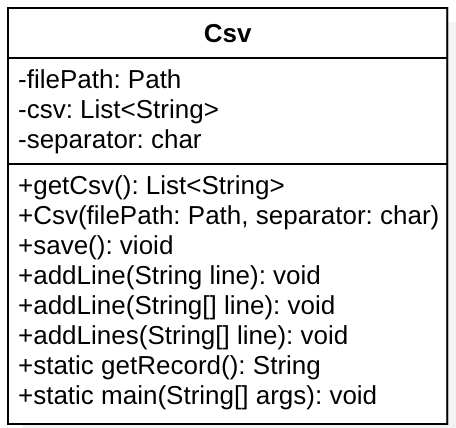

# Csv

|Package|File Name|Class Name|
|----------|---------|-------|
|helper.csv|Csv.java|CSV|

## Uses

Manage Csv Files, create csv file, load csv file from disk and update the csv.

## UML diagram 

## Tests
|Test Case      | TC-001                               |
|---------------|--------------------------------------|
|**Nome**       |Verifica dei campi di input |
|**Riferimento**|REQ-001 Sub-REQ-001                               |
|**Descrizione**|Controllare che i campi di input controllino i valori correttamente |
|**Prerequisiti**| La pagina di registrazione deve essere implementata |
|**Procedura**     |1. Istanziare un oggetto della classe CSV, indicando come path un file inesistente con il costruttore `Csv()`.    2. Inserire un Record nel file Csv con il metodo `addLine()`.    3. Salvare il record con il metodo `save()`.    4. Creare una nuova istanza della Classe Csv che apra il file precedentemente creato nel punto 1.    5. Inserire un Record nel file Csv con il metodo `add()`.   6. Salvare il record con il metodo `save()`. |
|**Risultati attesi** | Nel file Csv creato devono essere presenti entrambi i record creati. |