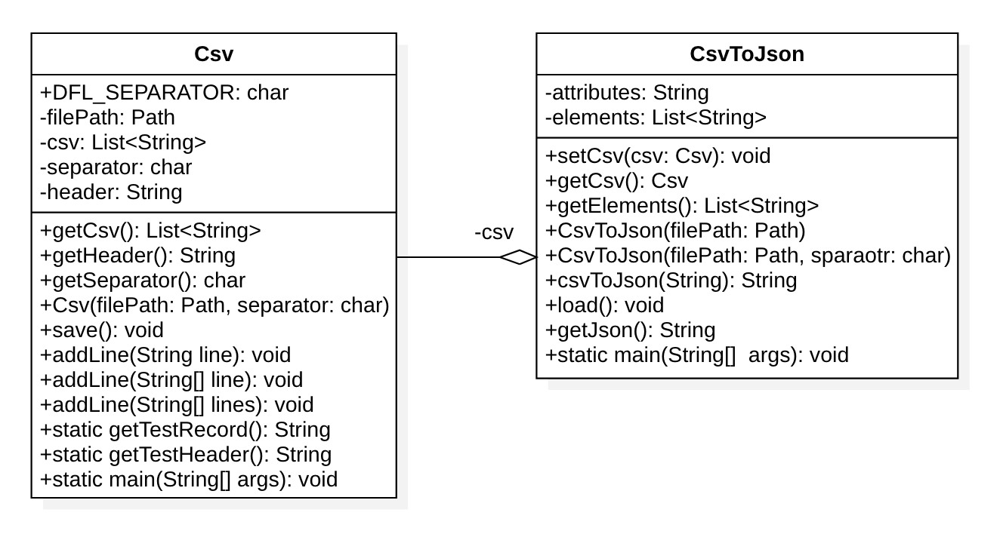

# PROGETTO1 | Diario di lavoro - 17.10.2018
##### Pinco Pallino
### Canobbio, 17.10.2018

## Lavori svolti

|Orario        |Lavoro svolto                 |
|--------------|------------------------------|
|13:15 - 13:50 |Fine implementazione Classe CsvToJson |
|13:50 - 14:15 |UML Diagrams |
|14:15 - 14:30 |Diario |
|14:30 - 14:45 |Documentazione |

### Fine implementazione Classe CsvToJson
La classe CsvToJson servirà per tradurre dei file CSV in dei file JSON.  
I file CSV devono avere un header. L'output dei file JSON avrà questo stile.
```json
[
{"attribute1":"value1", "attribute2": "value2"},
{"attribute1":"value1", "attribute2": "value2"}
]
```


Per usare la classe bisogna creare un istanza dell'oggetto con la path del file CSV e il separatore. Poi richiamare 
il metodo Csv.getJson() che ritorna una stringa con il contenuto del file JSON.

##  Problemi riscontrati e soluzioni adottate


##  Punto della situazione rispetto alla pianificazione
Sono Avanti rispetto alla pianificazione, ho gi&agrave; finito di implementare le classi per la scrittura dei dati.

## Programma di massima per la prossima giornata di lavoro
Iniziare a sviluppare le interfaccie grafiche.