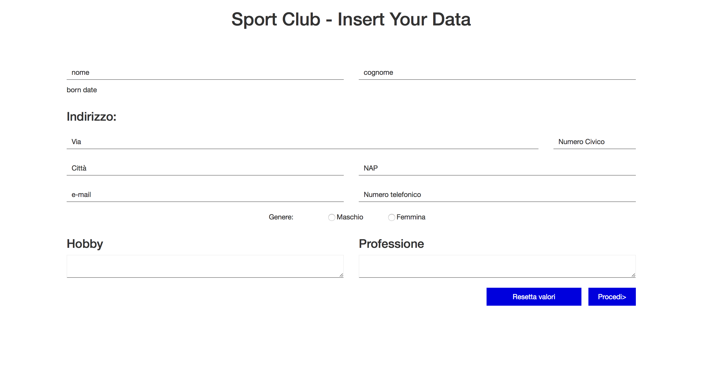
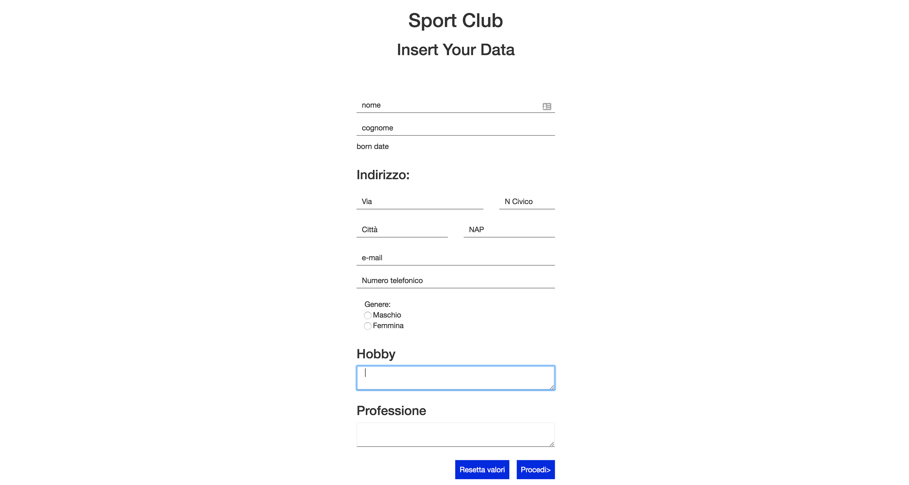

# PROGETTO1 | Diario di lavoro - 17.10.2018
##### Pinco Pallino
### Canobbio, 17.10.2018

## Lavori svolti

|Orario        |Lavoro svolto                 |
|--------------|------------------------------|
|13:15 - 14:10 |Implementazione: struttura pagina "insert" |
|14:10 - 14:25 |Implementazione: responsive pagina "insert" |
|14:25 - 14:45 |Implementazione: data di nascita nella pagina "insert" |
|15:00 - 14:10 |Implementazione: Record - getter per gli attributi del csv. |
|15:10 - 15:30 |Implementazione: CSV - problema con setHeader() |
|15:30 - 16:00 |Implementazione: Test della classe Record con scrittura sul CSV |
|16:00 - 16:05 |Implementazione: aggiunto al NameValidator l'accettazione degli spazi |
|16:05 - 16:15 |Diario |
|16:15 - 16:30 |Implementazione: modificato metodo modifica Address.nap, Address.civicNumberLetter |

### Implementazione: struttura pagina "insert"
Desktop:


Mobile:


### Implementazione: Test della classe Record con scrittura sul CSV

Codice utilizzato per il test:
```java
public class Test {
    public static void main(String[] args) {
            Record record = new Record();

            record.setName("John");
            record.setSurname("Doe");
            record.setBornDate(new Date(2000,1,1));
            Address recordAddress = new Address();
            recordAddress.setStreet("Via Garibaldi");
            recordAddress.setCivicNumberLetter("57");
            recordAddress.setCity("milano");
            recordAddress.setNap("20121");
            record.setAddress(recordAddress);
            record.setEmail("john.doe@example.com");
            record.setMf('m');//record.setPhoneNumber(41796278810);
            record.setHobby("Play Football");
            record.setWork("Writer");

            try {
                Path path = Paths.get("Csv.txt");
                Csv writer = new Csv(path, ';');
                writer.setHeader(record.getAttributesStrings());

                writer.addLine(record.getDataStrings());

                writer.save();
            } catch (IOException ioe) {
                System.out.println("ioe");
            } catch (NoCsvHeaderException nche) {
                System.out.println("nche");
            }
        }
}
```

##  Problemi riscontrati e soluzioni adottate

### Implementazione: struttura pagina "insert"

#### Radio buttons [solved]
Durante l'implementazione della struttura della pagina "insert" ho riscontrato dei problemi creando i radio button
potevano essere premuti entrambi.

Soluzione del problema trovata su: [w3schools.com - HTML](https://www.w3schools.com/html/tryit.asp?filename=tryhtml_radio)
https://www.w3schools.com/html/tryit.asp?filename=tryhtml_radio

### Implementazione: CSV - problema con setHeader()
Il setter del header del csv con i parametri giusti veniva interroto durante il controllo dei parametri, l'ho risolto
corrggendo il controllo dei dati.

##  Punto della situazione rispetto alla pianificazione
Sono circa allo stesso livello della pianificazione

## Programma di massima per la prossima giornata di lavoro
Sviluppare le interfaccie grafiche.
