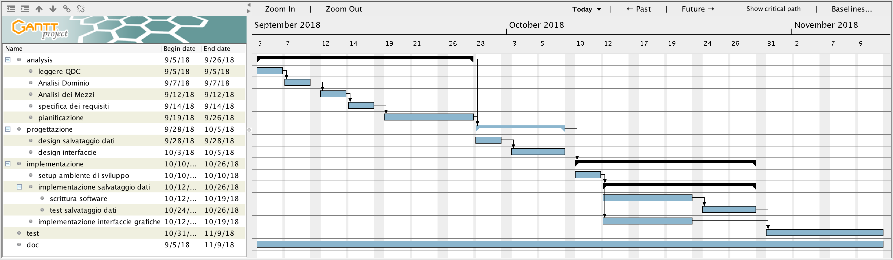
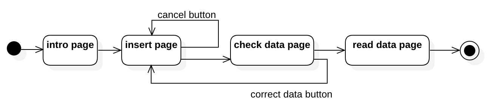
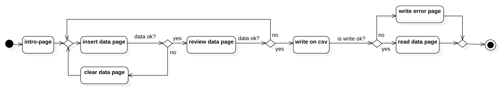

# documentation
##### Giulio Bosco - Progetto 1
1. [Introduzione](#introduzione)
    - [Informazioni sul progetto](#informazioni-sul-progetto)
    - [Abstract](#abstract)
    - [Scopo](#scopo)

1. [Analisi](#analisi)
    - [Analisi del dominio](#analisi-del-dominio)
    - [Analisi dei mezzi](#analisi-dei-mezzi)
    - [Analisi e specifica dei requisiti](#analisi-e-specifica-dei-requisiti)
    - [Use case](#use-case)
    - [Pianificazione](#pianificazione)

1. [Progettazione](#progettazione)
    - [Design dell’architettura del sistema](#design-dell’architettura-del-sistema)
    - [Design dei dati e database](#design-dei-dati-e-database)

1. [Implementazione](#implementazione)

1. [Test](#test)
    - [Protocollo di test](#protocollo-di-test)
    - [Risultati test](#risultati-test)
    - [Mancanze/limitazioni conosciute](#mancanze/limitazioni-conosciute)

1. [Consuntivo](#consuntivo)

1. [Conclusioni](#conclusioni)
    - [Sviluppi futuri](#sviluppi-futuri)
    - [Considerazioni personali](#considerazioni-personali)

1. [Sitografia](#sitografia)

1. [Allegati](#allegati)

## Introduzione

### Informazioni sul progetto

Allievo: Giulio Bosco \
Docenti: Luca Muggiasca, Adriano Barchi, Francesco Mussi, Elisa Nannini \
Scuola: Scuola Arti e Mestieri di Trevano \
Sezione: SAMT I3AA \
Data inizio: 05.09.2018 \
Data fine: 09.11.2018

### Abstract

E’ una breve e accurata rappresentazione dei contenuti di un documento,
senza notazioni critiche o valutazioni. Lo scopo di un abstract efficace
dovrebbe essere quello di far conoscere all’utente il contenuto di base
  di un documento e metterlo nella condizione di decidere se risponde ai
  suoi interessi e se è opportuno il ricorso al documento originale.

  Può contenere alcuni o tutti gli elementi seguenti:

  -   **Background/Situazione iniziale**

  -   **Descrizione del problema e motivazione**: Che problema ho cercato
      di risolvere? Questa sezione dovrebbe includere l'importanza del
      vostro lavoro, la difficoltà dell'area e l'effetto che potrebbe
      avere se portato a termine con successo.

  -   **Approccio/Metodi**: Come ho ottenuto dei progressi? Come ho
      risolto il problema (tecniche…)? Quale è stata l’entità del mio
      lavoro? Che fattori importanti controllo, ignoro o misuro?

  -   **Risultati**: Quale è la risposta? Quali sono i risultati? Quanto è
      più veloce, più sicuro, più economico o in qualche altro aspetto
      migliore di altri prodotti/soluzioni?

  Esempio di abstract:

  > *As the size and complexity of today’s most modern computer chips
  > increase, new techniques must be developed to effectively design and
  > create Very Large Scale Integration chips quickly. For this project, a
  > new type of hardware compiler is created. This hardware compiler will
  > read a C++ program, and physically design a suitable microprocessor
  > intended for running that specific program. With this new and powerful
  > compiler, it is possible to design anything from a small adder, to a
  > microprocessor with millions of transistors. Designing new computer
  > chips, such as the Pentium 4, can require dozens of engineers and
  > months of time. With the help of this compiler, a single person could
  > design such a large-scale microprocessor in just weeks.*

### Scopo

Una società sportiva richiede una applicazione web per raccogliere le iscrizioni al corso di introduzione alla disciplina praticata. L'applicazione deve salvare i dati in 2 file CSV, uno con tutte le registrazioni mentre il secondo con tutte le registrazioni eseguite in quel giorno.

## Analisi

### Analisi del dominio

Attualmente non vi è nessun prodotto che esegue le registrazione per la società sportiva.
Siccome l'applicazione servirà per raccogliere dati di persone sconosciute si presume che gli utenti non abbiano alcuna competenza informatica, l'applicazione potrebbe venire utilizzata sa qualunque dispositivo che possa avere accesso ad internet, quindi:
 - Dispositivi Mobile (Smartphone / Tablet)
 - Dispositivi Deskto

### Analisi e specifica dei requisiti

|ID  |REQ-001                                       |
|----|------------------------------------------------|
|**Nome**    |Dati |
|**Priorità**|1                     |
|**Versione**|1.0                   |
|**Note**    |File CSV|
|            |**Sotto requisiti** |
|**001**     | Salvare i file in 2 CSV (Registrazioni_tutte.csv, Registrazione_yyyy_mm_dd.csv)  |
|**002**     | File salvati nella root del sito sotto "Registrazioni" |
|**003**     | separatore ";" |
|**004**     | permessi di scrittura |

#

|ID  |REQ-002                                    |
|----|------------------------------------------------|
|**Nome**    |Pagine |
|**Priorità**|2                     |
|**Versione**|1.0                   |
|**Note**    | ci devono essere 4 pagine.|
|            |**Sotto requisiti** |
|**001**     | ci deve essere una pagina con una descrizione del prodotto: introduzione  |
|**002**     | ci deve essere una pagina di inserimento dei dati. |
|**003**     | ci deve essere una pagina per controllare i dati precedentemente inseriti. |
|**004**     | ci deve essere una pagina per visualizzare i dati appena inseriti. |

#

|ID  |REQ-003                                        |
|----|------------------------------------------------|
|**Nome**    | Pagina _Introduzione_ |
|**Priorità**|2                     |
|**Versione**|1.0                   |
|**Note**    |pagina di benventuto|
|            |**Sotto requisiti** |
|**001**     | Ci deve essere un tasto che porta alla pagina di inserimento dei dati.  |

#

|ID  |REQ-004                                       |
|----|------------------------------------------------|
|**Nome**    |Pagina _Inserzione Dati_ |
|**Priorità**|1                     |
|**Versione**|1.0                   |
|**Note**    |Form dei dati|
|            |**Sotto requisiti** |
|**001**     | Validazione dei dati  |
|**002**     | Ci deve essere un tasto che annulli l'inserimento fatto, cancelli tutti i contenuti dei campi. |
|**003**     | Ci deve essere un tasto che porti alla pagina di controllo dei dati. |

#

|ID  |REQ-005                                        |
|----|------------------------------------------------|
|**Nome**    |Pagina _Controllo Dati_ |
|**Priorità**|1                     |
|**Versione**|1.0                   |
|**Note**    |Controllare i dati|
|            |**Sotto requisiti** |
|**001**     | Mostrare dati come nel form di registrazione |
|**002**     | Ci deve essere un tasto per correggere i dati inseriti, che riporti alla pagina: _Inserzione Dati_ |
|**003**     | Ci deve essere un tasto per la registrazione, che scriva i dati sul csv e che poi porti alla pagina di _Lettura dei dati dal CSV_ |

#

|ID  |REQ-006                                        |
|----|------------------------------------------------|
|**Nome**    |Pagina _ Lettura dati da CSV_ |
|**Priorità**|2                    |
|**Versione**|1.0                   |
|**Note**    |presentazione dati|
|            |**Sotto requisiti** |
|**001**     | la grafica di questa pagina deve essere uguale alla pagina di registrazione |
|**002**     | la posizione dei campi deve essere uguale alla pagina di registrazione. |
|**002**     | dati letti da "Registrazione_yyyy_mm_dd.csv" |
|**003**     | Teasto per ritornare alla pagina benvenuto |

#

|ID  |REQ-007|
|----|------------------------------------------------|
|**Nome**    | Grafica |
|**Priorità**|3|
|**Versione**|1.0|
|**Note**    |La grafica delle pagine è a discrezione del esecutore. |

### Pianificazione

### Analisi dei mezzi

#### Software
- Librerie:
    - JavaScript
        - [AngularJS - v1.3.5](https://angularjs.org/)
        - [jQuery - v3.2.1](https://jquery.com/)
    - CSS
        - [Bootstrap - v3.3.4](http://getbootstrap.com/2.3.2/)
        - [FontAwesome - 4.3.0](https://fontawesome.com/)
- IDE:
    - [jetBrains IntelliJ IDEA](https://www.jetbrains.com/idea/)
- Progettazione:
    - [StarUML](http://staruml.io)
    - [Adobe PhotoShop](https://www.adobe.com/products/photoshop.html)
    - [Gantt Project](https://www.ganttproject.biz)

#### Hardware
- Sviluppo
    - portatile: MacBookPro 2017
        - Processore: Intel Core i7
        - RAM: 16GB
        - Disk: 1TB SSD

## Progettazione

### Design dell’architettura del sistema

Quando si entra nella prima pagina vi è un introduzione, dopo vi è una pagina
per l'inserimento dei dati, che ha 2 bottoni uno per procedere, il secondo

### Design dei dati e database

Salvataggio dei dati eseguito su due file CSV.
- Total CSV data file:
    - Contiene tutti i record
    - Path: "/Registrazioni/Registrazioni_tutte.csv"
- Daily CSV data file:
    - Contiene le registrazioni di un giorno.
    - Ogni giorno viene creato un nuovo file.
    - Path: "/Registrazioni/Registrazione_YYYY_MM_DD.csv"

Dati salvati nel CSV:  
Struttura dei dati:

|nome campo|tipo campo|
|-|-|
|data-ora|s|
|nome|testo|
|cognome|test|
|data_di_nascita|data|
|via|testo|
|numero civico|numero 3 cifre|
|citt&agrave;|testo|
|nap|numero 5 cifre|
|numero di telefono|testo (sole cifre, spazi, trattini)|
|e-mail|testo (controllo formato email)|
|genere|testo (solo M o F)|
|hobby|testo|
|professione|testo|

### Schema E-R, schema logico e descrizione.

Se il diagramma E-R viene modificato, sulla doc dovrà apparire l’ultima
versione, mentre le vecchie saranno sui diari.

### Design delle interfacce

Descrizione delle interfacce interne ed esterne del sistema e
dell’interfaccia utente. La progettazione delle interfacce è basata
sulle informazioni ricavate durante la fase di analisi e realizzata
tramite mockups.

### Design procedurale

Descrive i concetti dettagliati dell’architettura/sviluppo utilizzando
ad esempio:

-   Diagrammi di flusso e Nassi.

-   Tabelle.

-   Classi e metodi.

-   Tabelle di routing

-   Diritti di accesso a condivisioni …

Questi documenti permetteranno di rappresentare i dettagli procedurali
per la realizzazione del prodotto.

## Implementazione

In questo capitolo dovrà essere mostrato come è stato realizzato il
lavoro. Questa parte può differenziarsi dalla progettazione in quanto il
risultato ottenuto non per forza può essere come era stato progettato.

Sulla base di queste informazioni il lavoro svolto dovrà essere
riproducibile.

In questa parte è richiesto l’inserimento di codice sorgente/print
screen di maschere solamente per quei passaggi particolarmente
significativi e/o critici.

Inoltre dovranno essere descritte eventuali varianti di soluzione o
scelte di prodotti con motivazione delle scelte.

Non deve apparire nessuna forma di guida d’uso di librerie o di
componenti utilizzati. Eventualmente questa va allegata.

Per eventuali dettagli si possono inserire riferimenti ai diari.

## Test

### Protocollo di test

Definire in modo accurato tutti i test che devono essere realizzati per
garantire l’adempimento delle richieste formulate nei requisiti. I test
fungono da garanzia di qualità del prodotto. Ogni test deve essere
ripetibile alle stesse condizioni.

|Test Case      | TC-001                               |
|---------------|--------------------------------------|
|**Nome**       |Import a card, but not shown with the GUI |
|**Riferimento**|REQ-012                               |
|**Descrizione**|Import a card with KIC, KID and KIK keys with no obfuscation, but not shown with the GUI |
|**Prerequisiti**|Store on local PC: Profile\_1.2.001.xml (appendix n\_n) and Cards\_1.2.001.txt (appendix n\_n) |
|**Procedura**     | - Go to “Cards manager” menu, in main page click “Import Profiles” link, Select the “1.2.001.xml” file, Import the Profile - Go to “Cards manager” menu, in main page click “Import Cards” link, Select the “1.2.001.txt” file, Delete the cards, Select the “1.2.001.txt” file, Import the cards |
|**Risultati attesi** |Keys visible in the DB (OtaCardKey) but not visible in the GUI (Card details) |

### Risultati test

Tabella riassuntiva in cui si inseriscono i test riusciti e non del
prodotto finale. Se un test non riesce e viene corretto l’errore, questo
dovrà risultare nel documento finale come riuscito (la procedura della
correzione apparirà nel diario), altrimenti dovrà essere descritto
l’errore con eventuali ipotesi di correzione.

### Mancanze/limitazioni conosciute

Descrizione con motivazione di eventuali elementi mancanti o non
completamente implementati, al di fuori dei test case. Non devono essere
riportati gli errori e i problemi riscontrati e poi risolti durante il
progetto.

## Consuntivo

Consuntivo del tempo di lavoro effettivo e considerazioni riguardo le
differenze rispetto alla pianificazione (cap 1.7) (ad esempio Gannt
consuntivo).

## Conclusioni

Quali sono le implicazioni della mia soluzione? Che impatto avrà?
Cambierà il mondo? È un successo importante? È solo un’aggiunta
marginale o è semplicemente servita per scoprire che questo percorso è
stato una perdita di tempo? I risultati ottenuti sono generali,
facilmente generalizzabili o sono specifici di un caso particolare? ecc

### Sviluppi futuri
  Migliorie o estensioni che possono essere sviluppate sul prodotto.

### Considerazioni personali
  Cosa ho imparato in questo progetto? ecc

## Bibliografia

### Bibliografia per articoli di riviste
1.  Cognome e nome (o iniziali) dell’autore o degli autori, o nome
    dell’organizzazione,

2.  Titolo dell’articolo (tra virgolette),

3.  Titolo della rivista (in italico),

4.  Anno e numero

5.  Pagina iniziale dell’articolo,

### Bibliografia per libri

1.  Cognome e nome (o iniziali) dell’autore o degli autori, o nome
    dell’organizzazione,

2.  Titolo del libro (in italico),

3.  ev. Numero di edizione,

4.  Nome dell’editore,

5.  Anno di pubblicazione,

6.  ISBN.

### Sitografia

1.  URL del sito (se troppo lungo solo dominio, evt completo nel
    diario),

2.  Eventuale titolo della pagina (in italico),

3.  Data di consultazione (GG-MM-AAAA).

**Esempio:**

-   http://standards.ieee.org/guides/style/section7.html, *IEEE
    Standards Style Manual*, 07-06-2008.

## Allegati

Elenco degli allegati, esempio:

-   Diari di lavoro

-   Codici sorgente/documentazione macchine virtuali

-   Istruzioni di installazione del prodotto (con credenziali
    di accesso) e/o di eventuali prodotti terzi

-   Documentazione di prodotti di terzi

-   Eventuali guide utente / Manuali di utilizzo

-   Mandato e/o Qdc

-   Prodotto

-   …
