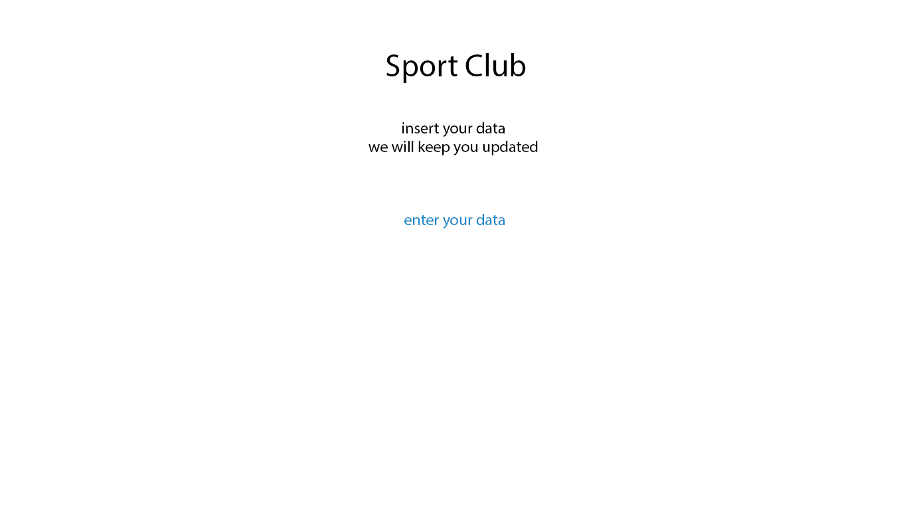
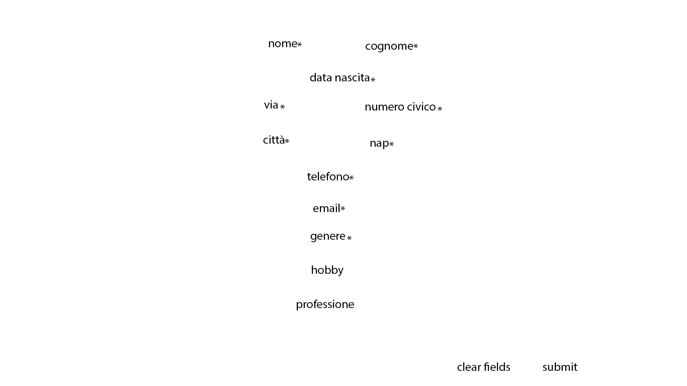
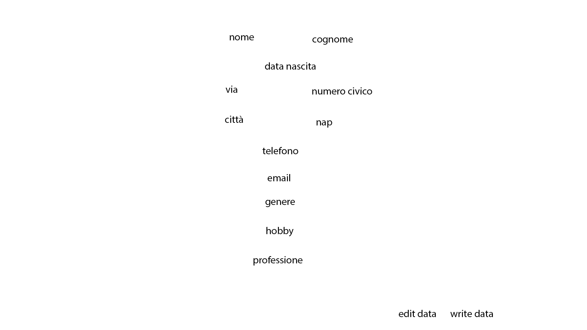
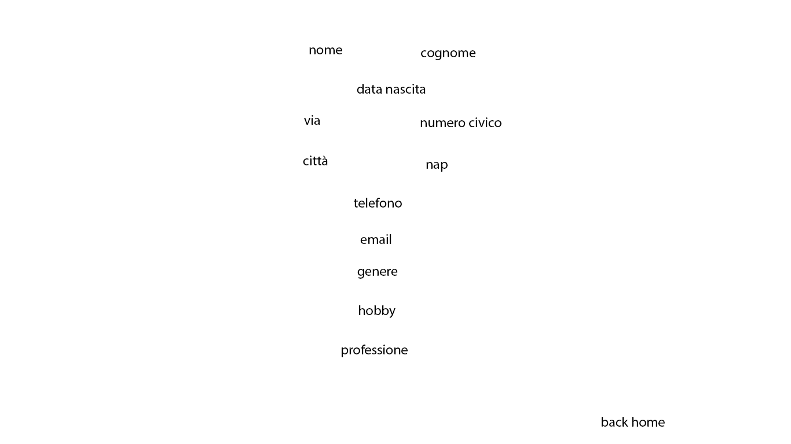
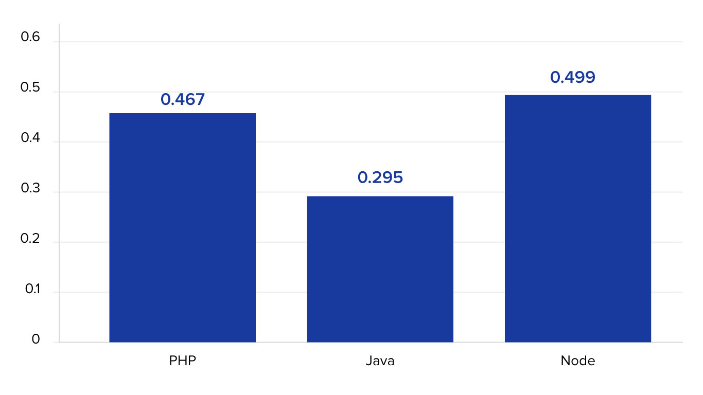

# Progetto1
##### Giulio Bosco - Progetto 1
1. [Introduzione](#introduzione)
    - [Informazioni sul progetto](#informazioni-sul-progetto)
    - [Abstract](#abstract)
    - [Scopo](#scopo)

1. [Analisi](#analisi)
    - [Analisi del dominio](#analisi-del-dominio)
    - [Analisi dei mezzi](#analisi-dei-mezzi)
    - [Analisi e specifica dei requisiti](#analisi-e-specifica-dei-requisiti)
    - [Use case](#use-case)
    - [Pianificazione](#pianificazione)

1. [Progettazione](#progettazione)
    - [Design dell’architettura del sistema](#design-dell’architettura-del-sistema)
    - [Design dei dati e database](#design-dei-dati-e-database)

1. [Implementazione](#implementazione)

1. [Test](#test)
    - [Protocollo di test](#protocollo-di-test)
    - [Risultati test](#risultati-test)
    - [Mancanze/limitazioni conosciute](#mancanze/limitazioni-conosciute)

1. [Consuntivo](#consuntivo)

1. [Conclusioni](#conclusioni)
    - [Sviluppi futuri](#sviluppi-futuri)
    - [Considerazioni personali](#considerazioni-personali)

1. [Sitografia](#sitografia)

1. [Allegati](#allegati)


## Introduzione

### Informazioni sul progetto

Allievo: Giulio Bosco \
Docenti: Luca Muggiasca, Adriano Barchi, Francesco Mussi, Elisa Nannini \
Scuola: Scuola Arti e Mestieri di Trevano \
Sezione: SAMT I3AA \
Data inizio: 05.09.2018 \
Data fine: 09.11.2018

### Abstract

E’ una breve e accurata rappresentazione dei contenuti di un documento,
senza notazioni critiche o valutazioni. Lo scopo di un abstract efficace
dovrebbe essere quello di far conoscere all’utente il contenuto di base
  di un documento e metterlo nella condizione di decidere se risponde ai
  suoi interessi e se è opportuno il ricorso al documento originale.

  Può contenere alcuni o tutti gli elementi seguenti:

  -   **Background/Situazione iniziale**

  -   **Descrizione del problema e motivazione**: Che problema ho cercato
      di risolvere? Questa sezione dovrebbe includere l'importanza del
      vostro lavoro, la difficoltà dell'area e l'effetto che potrebbe
      avere se portato a termine con successo.

  -   **Approccio/Metodi**: Come ho ottenuto dei progressi? Come ho
      risolto il problema (tecniche…)? Quale è stata l’entità del mio
      lavoro? Che fattori importanti controllo, ignoro o misuro?

  -   **Risultati**: Quale è la risposta? Quali sono i risultati? Quanto è
      più veloce, più sicuro, più economico o in qualche altro aspetto
      migliore di altri prodotti/soluzioni?

  Esempio di abstract:

  > *As the size and complexity of today’s most modern computer chips
  > increase, new techniques must be developed to effectively design and
  > create Very Large Scale Integration chips quickly. For this project, a
  > new type of hardware compiler is created. This hardware compiler will
  > read a C++ program, and physically design a suitable microprocessor
  > intended for running that specific program. With this new and powerful
  > compiler, it is possible to design anything from a small adder, to a
  > microprocessor with millions of transistors. Designing new computer
  > chips, such as the Pentium 4, can require dozens of engineers and
  > months of time. With the help of this compiler, a single person could
  > design such a large-scale microprocessor in just weeks.*

### Scopo

Una società sportiva richiede una applicazione web per raccogliere le iscrizioni al corso di introduzione alla disciplina praticata. L'applicazione deve salvare i dati in 2 file CSV, uno con tutte le registrazioni mentre il secondo con tutte le registrazioni eseguite in quel giorno.

## Analisi

### Analisi del dominio

Attualmente non vi è nessun prodotto che esegue le registrazione per la società sportiva.
Siccome l'applicazione servirà per raccogliere dati di persone sconosciute si presume che gli utenti non abbiano alcuna competenza informatica, l'applicazione potrebbe venire utilizzata sa qualunque dispositivo che possa avere accesso ad internet, quindi:
 - Dispositivi Mobile (Smartphone / Tablet)
 - Dispositivi Deskto

### Analisi e specifica dei requisiti


|ID  |REQ-001                                       |
|----|------------------------------------------------|
|**Nome**    |Dati |
|**Priorità**|1                     |
|**Versione**|1.0                   |
|**Note**    |File CSV|
|            |**Sotto requisiti** |
|**001**     | Salvare i file in 2 CSV (Registrazioni_tutte.csv, Registrazione_yyyy_mm_dd.csv)  |
|**002**     | File salvati nella root del sito sotto "Registrazioni" |
|**003**     | separatore ";" |
|**004**     | permessi di scrittura |

#

|ID  |REQ-002                                    |
|----|------------------------------------------------|
|**Nome**    |Pagine |
|**Priorità**|2                     |
|**Versione**|1.0                   |
|**Note**    | ci devono essere 4 pagine.|
|            |**Sotto requisiti** |
|**001**     | ci deve essere una pagina con una descrizione del prodotto: introduzione  |
|**002**     | ci deve essere una pagina di inserimento dei dati. |
|**003**     | ci deve essere una pagina per controllare i dati precedentemente inseriti. |
|**004**     | ci deve essere una pagina per visualizzare i dati appena inseriti. |

#

|ID  |REQ-003                                        |
|----|------------------------------------------------|
|**Nome**    | Pagina _Introduzione_ |
|**Priorità**|2                     |
|**Versione**|1.0                   |
|**Note**    |pagina di benventuto|
|            |**Sotto requisiti** |
|**001**     | Ci deve essere un tasto che porta alla pagina di inserimento dei dati.  |

#

|ID  |REQ-004                                       |
|----|------------------------------------------------|
|**Nome**    |Pagina _Inserzione Dati_ |
|**Priorità**|1                     |
|**Versione**|1.0                   |
|**Note**    |Form dei dati|
|            |**Sotto requisiti** |
|**001**     | Validazione dei dati  |
|**002**     | Ci deve essere un tasto che annulli l'inserimento fatto, cancelli tutti i contenuti dei campi. |
|**003**     | Ci deve essere un tasto che porti alla pagina di controllo dei dati. |

#

|ID  |REQ-005                                        |
|----|------------------------------------------------|
|**Nome**    |Pagina _Controllo Dati_ |
|**Priorità**|1                     |
|**Versione**|1.0                   |
|**Note**    |Controllare i dati|
|            |**Sotto requisiti** |
|**001**     | Mostrare dati come nel form di registrazione |
|**002**     | Ci deve essere un tasto per correggere i dati inseriti, che riporti alla pagina: _Inserzione Dati_ |
|**003**     | Ci deve essere un tasto per la registrazione, che scriva i dati sul csv e che poi porti alla pagina di _Lettura dei dati dal CSV_ |

#

|ID  |REQ-006                                        |
|----|------------------------------------------------|
|**Nome**    |Pagina _ Lettura dati da CSV_ |
|**Priorità**|2                    |
|**Versione**|1.0                   |
|**Note**    |presentazione dati|
|            |**Sotto requisiti** |
|**001**     | la grafica di questa pagina deve essere uguale alla pagina di registrazione |
|**002**     | la posizione dei campi deve essere uguale alla pagina di registrazione. |
|**002**     | dati letti da "Registrazione_yyyy_mm_dd.csv" |
|**003**     | Teasto per ritornare alla pagina benvenuto |

#

|ID  |REQ-007|
|----|------------------------------------------------|
|**Nome**    | Grafica |
|**Priorità**|3|
|**Versione**|1.0|
|**Note**    |La grafica delle pagine è a discrezione del esecutore. |


### Pianificazione


### Analisi dei mezzi

#### Software
- Librerie:
    - JavaScript
        - [AngularJS - v1.3.5](https://angularjs.org/)
        - [jQuery - v3.2.1](https://jquery.com/)
    - CSS
        - [Bootstrap - v3.3.4](http://getbootstrap.com/2.3.2/)
        - [FontAwesome - 4.3.0](https://fontawesome.com/)
    - Java
        - [Java Tomcat - v9.0.10](https://tomcat.apache.org)
- IDE:
    - [jetBrains IntelliJ IDEA](https://www.jetbrains.com/idea/)
- Progettazione:
    - [StarUML](http://staruml.io)
    - [Adobe PhotoShop](https://www.adobe.com/products/photoshop.html)
    - [Gantt Project](https://www.ganttproject.biz)

#### Hardware
- Sviluppo
    - portatile: Apple - MacBookPro 2017
        - Processore: Intel Core i7
        - RAM: 16GB
        - Disk: 1TB SSD

## Progettazione

### Design dell’architettura del sistema

Quando si entra nella prima pagina vi è un introduzione, dopo vi è una pagina
per l'inserimento dei dati, che ha 2 bottoni uno per procedere, il secondo


### Design dei dati e database

Salvataggio dei dati eseguito su due file CSV.
- Total CSV data file:
    - Contiene tutti i record
    - Path: "/Registrazioni/Registrazioni_tutte.csv"
- Daily CSV data file:
    - Contiene le registrazioni di un giorno.
    - Ogni giorno viene creato un nuovo file.
    - Path: "/Registrazioni/Registrazione_YYYY_MM_DD.csv"

Dati salvati nel CSV:  
Struttura dei dati:

|nome campo|tipo campo|
|----------|----------|
|data-ora|s|
|nome|testo|
|cognome|test|
|data_di_nascita|data|
|via|testo|
|numero civico|numero 3 cifre|
|citt&agrave;|testo|
|nap|numero 5 cifre|
|numero di telefono|testo (sole cifre, spazi, trattini)|
|e-mail|testo (controllo formato email)|
|genere|testo (solo M o F)|
|hobby|testo|
|professione|testo|

### Design delle interfacce

#### Pagina di introduzione


In questa pagina vi è una introduzione al sito.  
Con un bottone per spostarsi sulla pagina di inserimento dei dati.

#### Pagina inserimento dati


In questa pagina vi sono i campi per inserire i dati.  
Ci sono i seguenti campi di input, (quelli con * sono obbligatori):
- Nome*
- Cognome*
- Data di nascita*
- Indirizzo
    - Cia*
    - Numero civico*
    - Cap*
    - Città*
- Numero di telefono*
- Indirizzo e-mail*
- Hobby
- Professione

Ci saranno anche due bottoni, uno per procedere ed uno per resettare tutti i campi.

#### Pagina controllo dei dati


Nella pagina di controllo dei dati, vi sarnno gli stessi campi che nella precedente.  
Vi saranno sempre due bottoni, ma con due funzionalità diverse, uno scriverà i dati nel file CSV mentre il secondo permetterà di tornare alla pagina precedente per modificare i dati inseriti.

#### Pagina di lettura dei dati


Nella pagina di lettura dei dati, vi sarà la possibilità di leggere l'ultimo dato inserito, o i dati inseriti nella giornata corrente (per orario del server), oppure tutti i dati inseriti.  
Questo sarà possibile tramite te sezioni, con un menu sopra le quali.

### Design procedurale


Entrando nel sito ci sarà una pagina di introduzione, poi la pagina di inserimento dati, dalla quale si puo procedere oppure resettare tutti i campi. Proseguendo vi è la pagina di controllo dei dati, dalla quale si può procedere oppure ritornare sull'inserimento dei dati e modificare i nomi. Procedendo si va sulla pagina di lettura dei dati.

## Implementazione

### Web Server

Per implementare la parte back-end di questo progetto (cioè la parte lato server), vi erano alcune opsioni di linguaggi di programmazione o scripting per eseguire le operazioni di lettura e scrittura sui file:

- PHP
- Java
- NodeJS


[toptal.com](http://toptal.coms)

In questo grafico è mostrato il tempo di risposta per una richiesta a parità di prestazioni del server.  
Si può notare che Java è nettamente più veloce di PHP e NodeJS (questo accade soprattutto quando bisogna eseguire degli algoritmi o operazioni complicate). Questa grande differenza sta nel fatto che Java viene compilato e non interpretato come gli altri due linguaggi.

Per questo progetto la differenza è minima e non verrebbe neanche notato dall'utente finale se viene usato un sistema o l'altro. Ho deciso di utilizzare comunque Java (non ostante ero a conoscenza che avrei riscontrato più difficoltà nello sviluppo dell'applicativo; Ed avrei speso molto tempo a capire come funziona il web server in Java). Ho preso questa decisione per iniziare a prendere confidenza con questo sistema, che potrebbe essermi molto utile in progetti più grandi ed importanti dove si ricerca il massimo della prestazione.  

#### Configurazione del web-server

Scaricare ed installare la Java Virtual Machine (JRE - Java Runtime Environment) e Java Development Kit (JDK).

```URL
http://www.oracle.com/technetwork/java/javase/downloads/index.html
```

Scariare i file binari di Tomcat:
```URL
http://tomcat.apache.org/
```

Per configurare le variabili d'ambiente di tomcat si può usare lo script fornito assieme hai file binari oppure manualmente (Guida per installazione manuale fornita assieme a tomcat). Lo script è disponibile sia per UNIX (`setevn.sh`), che per windows (`setevn.bat`), in entrambi i casi va abilitato.

### Ambiente di sviluppo
JetBrains IntelliJ IDEA, un tool professionale per sviluppo in Java. Utilizzandolo con la licenza "education" è gratuito. Siccome l'applicativo non verrà venduto, si ha il diritto di utilizzare questa licenza.

#### Installazione IntelliJ IDEA
Scaricare il file di installazione dal [sito ufficiale](https://www.jetbrains.com/idea/) ed avviarlo, poi seguire la procedura guidata.

#### Configurazione Apache Tomcat con IntelliJ IDEA
Prima di tutto bisogna configurare il web server Apache Tomcat (Capitolo precedente).

Poi creare il progetto seguendo la procedura guidata per creare un progetto di tipo:  
`Java Enterprise > Web Application` dopo di che aggiungere una configurazione di web server, scegliere il tipo `Tomcat > Local`, poi cliccare su `Configure`, li aggiungere un server inserendo il suo nome ed il percorso dei file binari precedentemente scaricati.  


### Sviluppo applicativo

#### Validazione dei dati
La validazione dei dati è fatta sia in front-end che in back-end, questo per garantire velocità e prestazioni (front-end) e sicurezza dell'inserimento corretto dei dati (back-end).

#### Struttura web
```
 --- /index.html            (Pagina introduzione)
  |
  |- /insert.html           (Pagina inserimento dati)
  |
  |- /Insert                (Java InsertsServlet - Controllo inserimento dei dati)
  |
  |- /check.jsp             (Pagina di controllo dei dati)
  |
  |- /edit.jsp              (Pagina di modifica dei dati)
  |
  |- /Save                  (Java SaveServlet - Salvataggio dei dati)
  |
  |- /read.html             (Pagina di lettura dei dati)
   |- assets/data/last.jsp  (Ultimo record in formato JSON)
   |- assets/data/today.jsp (Registrazioni con la data odierna del server in formato JSON)
   |- assets/data/all.jsp   (Tutte le registrazioni in formato JSON)
```

#### Front-End
Per sviluppare le interfacce grafiche è stato utilizzato HTML & CSS (e Bootstrap), per la validazione dei dati JavaScript con la libreria jQuery e per interpretare i dati AngularJS (nella pagina di lettura dei dati).

##### Introduzione

La pagina di introduzione è il file: `index.html`.

Contiene il titolo della pagina ed un link alla pagina di inserimento dati.

##### Inserimento dati

La pagina di inserimento dei dati è il file: `insert.html`.

La pagina di inserimento dati rispetta l'ordine dei campi come nel design delle interfaccie grafiche, sono stati migliorati gli aspetti grafici rispetto a quello che si pensava inizialmente.

Quando un campo non è completato correttamente si colora il testo di rosso ed anche il bordo inferiore del elemento di input. La validazione dei dati è eseguita con dei validator scritti in JavaScript ed utilizzando jQuery per selezionare i campi da controllare, gestire i valori e gestire i colori (del testo e del bordo).

Inizialmente per il campo della data si voleva inserire un campo di inserimento data con il calendario, poi pensando che dovendo inserire delle date di nascita, bisogna scorrere tutti i mesi di tutti gli anni, questo processo rischia di diventare molto lungo. Quindi è meglio un campo per il giorno, uno per il mese ed uno per l'anno.

Quando tutti i campi obbligatori sono riempiti correttamente il bottone `procedi` si sblocca. È presente anche un'altro bottone che resetta tutti i valori.

Invia i dati con il metodo POST alla JavaServlet `SaveServlet` identificata lato web con la definizione di accesso `/Save`.

##### Controllo dei dati

La pagina del controllo dei dati è sul file: `check.jsp`.

La pagina è la stessa di quella dell'inserimento dei dati, con la differenza che i campi sono bloccati, quindi i valori non sono modificabili. Anche i due bottoni hanno funzionalità diverse, uno serve per richiamare la pagina di modifica dei dati, mentre il secondo per scrivere sul file.

##### Modifica dei dati

La pagina di modifica dei dati è sul file: `edit.jsp`.

La pagina è quella di introduzione, solamente che prende i valori dalla sessione e li inserisce già nei campi. Così da essere pronti per essere modificati.

##### La pagina di lettura dei dati

La pagina di lettura dei dati è sul file `read.html`.

La pagina di lettura dei dati è composta dal titolo della pagina, una barra di navigazione con 3 opsioni, ultimo record, record odierni e tutti i record. Ogniuna di queste voci avrà una sezione (solo quella selezionata sarà visibile).

Nella prima sarà visibile subito tutto il contenuto della registrazione; mentre nelle seconde due sarà visibile subito il nome, il cognome e la data di nascita. cliccandovi sopra si potranno vedere tutti i dati.

I dati vengono richiesti al server tramite una richiesta AJAX, il server ritorna un file JSON (uno per ogni sezione), che verrà interpretato da AngularJS.

#### Back-End

Il back-end dell'applicativo è stato sviluppato in Java, utilizzando il web server Apache Tomcat (v9.0.10).

##### Validators
Come prima cosa sono stati implementati i `validators`, cioè le classi che si occupano della validazione dei dati.
I validatori sono:

|Nome|Utilizzo|
|----|--------|
|Validator|Validazione di stringa, controllo della lunghezza|
|DateValidator|Validazione di oggetti data|
|DomainValidator|Validazione di dominii internet|
|UsernameValidator|Validazioni di username|
|EmailValidator|Validazione di indirizzi email (utilizza UsernameValidator e DomainValidator)|
|IntegerValidator|Validazione di numeri interi|
|NumberValidator|Controlla il numero di cifre|
|NameValidator|Validazione di Nomi, controlla che siano tutte lettere (anche con accenti)|

##### CSV & Dati

Dopo i validatori sono state implementate le classi relative alla gestione dei dati, più precisamente le classi relative al CSV e hai record del CSV.

- Csv - Gestione dei file CSV, inserimento e lettura dei dati   
    In questa classe engono utilizzati principalmente i paradigmi di programmazione relativi al file system e all'interpretazione dei dati da un CSV.
- CsvToJson - Convertire il formato CSV ad una forma JSON di base  
    In questa classe viene utilizzata la classe Csv per interpretare i dati e poi vengono trasformati sotto forma di JSON, in una stringa.
- Address - Indirizzo: Via, Numero civico, Città, CAP, Paese
- Record - Struttura del CSV e dati con relativa validazione  
    Struttura dei dati da registrare nell'applicativo
- RecordManager - Gestione dei Record, Lettura o scrittura nel record  
    Gestione dei CSV, per raggruppare la logica di gestione dei CSV.

##### Analisi dei dati

Per facilitare il lavoro di controllo e analisi dei dati sono state create delle classi che analizzano le richieste e le sessioni HTTP.  
Controllano che vi siano i dati obbligatori e che siano corretti, poi li prepara per poter essere passati alla classe Record.  
Gli analyzer sono strettamente legati al record, quindi per altri utilizzi vanno riviste alcune parti.

##### JavaServlets & JSP
Le JavaServlets sono classi che vengono richiamate con delle richieste HTTP (o HTTPS) con almeno due metodi:

- `doGet` (viene richiamato quando la richiesta è in get)
- `doPost` (viene richiamato quando la richiesta é in post)

Solitamente non vengono utilizzate per ritornare delle pagine HTML, ma per eseguire operazioni più complesse (Spesso eseguono un redirect su una pagina dinamica o statica). Mentre per ritornare pagine HTML (Pagine dinamiche) vengono utilizzate le JSP (JavaServer Peages).

Le parti più complicate delle JavaServlets e JSPs sono la gestione delle sessioni utilizzata per mantenere i dati.  
Siccome prima di creare la sessione vengono eseguiti molti controlli è stato deciso di spostare il codice relativo alla sessione negli analyzer.

## Test

### Protocollo di test

Definire in modo accurato tutti i test che devono essere realizzati per
garantire l’adempimento delle richieste formulate nei requisiti. I test
fungono da garanzia di qualità del prodotto. Ogni test deve essere
ripetibile alle stesse condizioni.


|Test Case      | TC-001                               |
|---------------|--------------------------------------|
|**Nome**       |Import a card, but not shown with the GUI |
|**Riferimento**|REQ-012                               |
|**Descrizione**|Import a card with KIC, KID and KIK keys with no obfuscation, but not shown with the GUI |
|**Prerequisiti**|Store on local PC: Profile\_1.2.001.xml (appendix n\_n) and Cards\_1.2.001.txt (appendix n\_n) |
|**Procedura**     | - Go to “Cards manager” menu, in main page click “Import Profiles” link, Select the “1.2.001.xml” file, Import the Profile - Go to “Cards manager” menu, in main page click “Import Cards” link, Select the “1.2.001.txt” file, Delete the cards, Select the “1.2.001.txt” file, Import the cards |
|**Risultati attesi** |Keys visible in the DB (OtaCardKey) but not visible in the GUI (Card details) |

#### Test moduli
|Test Case      | TC-001                               |
|---------------|--------------------------------------|
|**Nome**       |Verifica dei campi di input |
|**Riferimento**|REQ-004 Sub-REQ-001                               |
|**Descrizione**|Controllare che i campi di input controllino i valori correttamente |
|**Prerequisiti**| La pagina di registrazione deve essere implementata |
|**Procedura**     |1. inserire i propri dati nella pagina di registrazione. <br> 2. verificare che nessun campo venga sottolinato di rosso. |
|**Risultati attesi** |Nessun dato deve essere sottolineato di rosso. |

-


### Risultati test

Tabella riassuntiva in cui si inseriscono i test riusciti e non del
prodotto finale. Se un test non riesce e viene corretto l’errore, questo
dovrà risultare nel documento finale come riuscito (la procedura della
correzione apparirà nel diario), altrimenti dovrà essere descritto
l’errore con eventuali ipotesi di correzione.

### Mancanze/limitazioni conosciute

Descrizione con motivazione di eventuali elementi mancanti o non
completamente implementati, al di fuori dei test case. Non devono essere
riportati gli errori e i problemi riscontrati e poi risolti durante il
progetto.

## Consuntivo

Consuntivo del tempo di lavoro effettivo e considerazioni riguardo le
differenze rispetto alla pianificazione (cap 1.7) (ad esempio Gannt
consuntivo).

## Conclusioni

Quali sono le implicazioni della mia soluzione? Che impatto avrà?
Cambierà il mondo? È un successo importante? È solo un’aggiunta
marginale o è semplicemente servita per scoprire che questo percorso è
stato una perdita di tempo? I risultati ottenuti sono generali,
facilmente generalizzabili o sono specifici di un caso particolare? ecc

### Sviluppi futuri
  Migliorie o estensioni che possono essere sviluppate sul prodotto.

### Considerazioni personali
  Cosa ho imparato in questo progetto? ecc

## Bibliografia

### Bibliografia per articoli di riviste
1.  Cognome e nome (o iniziali) dell’autore o degli autori, o nome
    dell’organizzazione,

2.  Titolo dell’articolo (tra virgolette),

3.  Titolo della rivista (in italico),

4.  Anno e numero

5.  Pagina iniziale dell’articolo,

### Bibliografia per libri


1.  Cognome e nome (o iniziali) dell’autore o degli autori, o nome
    dell’organizzazione,

2.  Titolo del libro (in italico),

3.  ev. Numero di edizione,

4.  Nome dell’editore,

5.  Anno di pubblicazione,

6.  ISBN.

### Sitografia

1.  URL del sito (se troppo lungo solo dominio, evt completo nel
    diario),

2.  Eventuale titolo della pagina (in italico),

3.  Data di consultazione (GG-MM-AAAA).

**Esempio:**

-   http://standards.ieee.org/guides/style/section7.html, *IEEE
    Standards Style Manual*, 07-06-2008.

## Allegati

Elenco degli allegati, esempio:

-   Diari di lavoro

-   Codici sorgente/documentazione macchine virtuali

-   Istruzioni di installazione del prodotto (con credenziali
    di accesso) e/o di eventuali prodotti terzi

-   Documentazione di prodotti di terzi

-   Eventuali guide utente / Manuali di utilizzo

-   Mandato e/o Qdc

-   Prodotto

-   …
